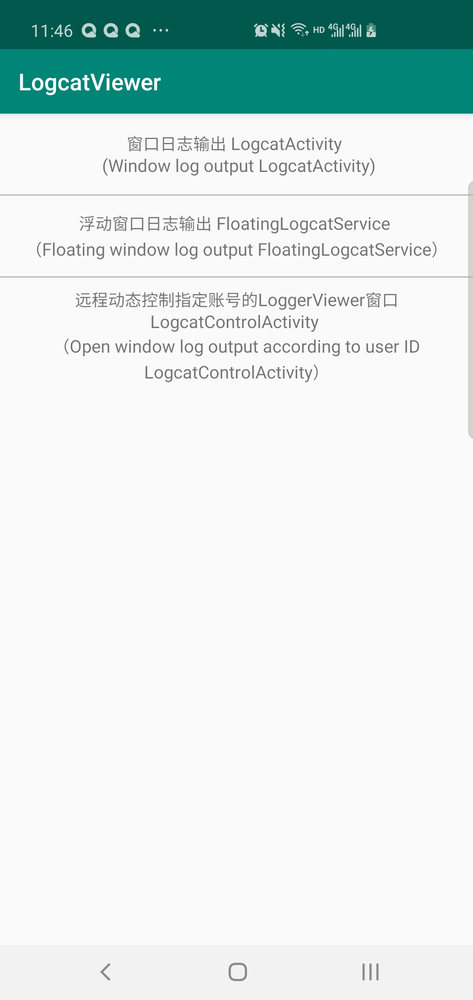
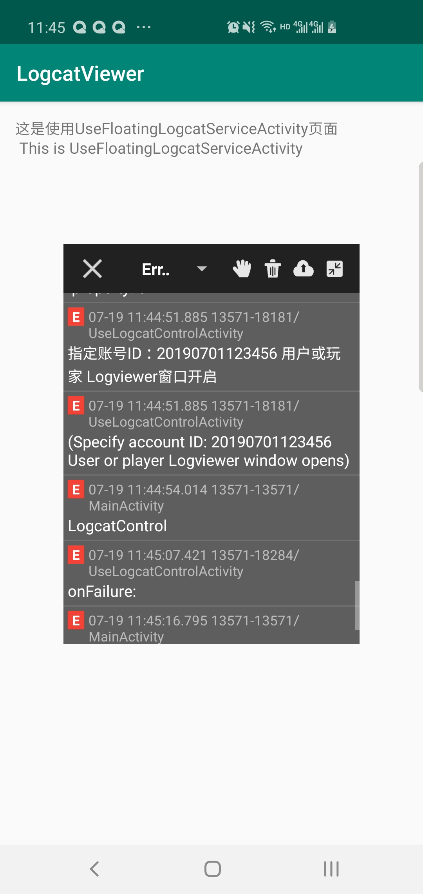
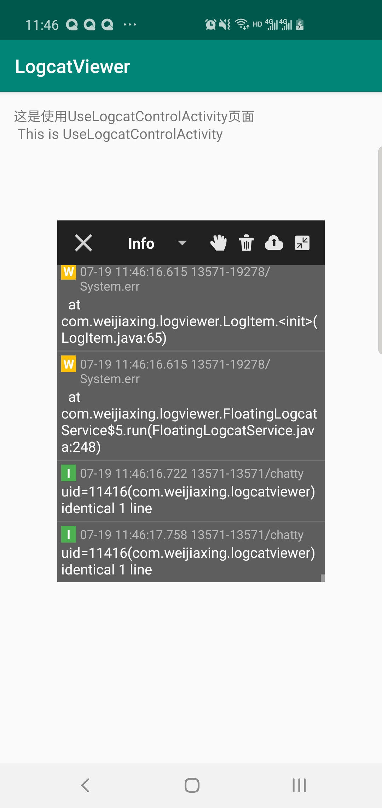

# LogcatViewer [](https://jitpack.io/#weijiaxing/LogcatViewer) [](https://github.com/weijiaxing/LogcatViewer/blob/master/LICENSE) 

### [README of Chinese](https://github.com/weijiaxing/LogcatViewer/blob/master/README.md)

LogcatViewer is an Android floating window log output library! Get the logcat output log of the application and float it in the upper layer of the application in the form of a window, support floating window zooming, dragging, support log file filtering, clear, save and share. Customizable interface remote dynamic control LogcatViewer floating log window display and shutdown, test phase (convenient for testers and developers to locate anomalies), release online phase (dynamic control of specified account user LogcatViewer floating log window display and shutdown, convenient for abnormal models User feedback issues, developers adapt to specific models). Description: Dynamically control the specified account user LogcatViewer floating log window display and shutdown, integrate the library and refer to the remoteControlLogviewer() method in the sample code UseLogcatControlActivity class, isOpenLogcatViewer.equals(isOpenLogcatViewerCode)&& accountId.equals(loginAccountId), background dynamic control LogcatViewer control The parameters returned by the interface network request isOpenLogcatViewer, accountId and isOpenLogcatViewerCode, and loginAccountId are compared to determine whether the LogcatViewer floating log window of the user or the specified account user is displayed and closed.

### Introduction to LogcatViewer function

 * Log output filtering
 * Floating window drag
 * Log output clear
 * Share save log log text
 * Log log page zooms in and out
 
### GooglePlay download or QR code scan code download Apk
<a href="https://play.google.com/store/apps/details?id=com.zytmcq.zy" target="_blank"> 
  </a>


### Usage
##### Step 1. Add a JitPack repertory
```
allprojects {
    repositories {
        ...
        maven { url "https://jitpack.io" }
    }
}
```

##### Step 2. Add a gradle dependency
```
dependencies {
	implementation 'com.github.weijiaxing:LogcatViewer:1.0.3'
}
```

##### Step 3. Add following provider code to your AndroidManifest.xml
```
<provider
    android:name="com.weijiaxing.logviewer.LogcatFileProvider"
    android:authorities="${applicationId}.logcat_fileprovider"
    android:grantUriPermissions="true"
    android:exported="false">
    <meta-data
        android:name="android.support.FILE_PROVIDER_PATHS"
        android:resource="@xml/logcat_filepaths" />
</provider>
```

##### Step 4. Use the class in the need to print the log
```
public class MainActivity extends AppCompatActivity {

    @Override
    protected void onCreate(Bundle savedInstanceState) {
        super.onCreate(savedInstanceState);
        setContentView(R.layout.activity_main);

        //Use this method
        LogcatActivity.launch(MainActivity.this);
    }
}
```


## Screenshots

### Sample application
    


### Project practical application
    


### Thanks
- [fatangare：LogcatViewer](https://github.com/fatangare/LogcatViewer) 
- [kyze8439690：logcatviewer](https://github.com/kyze8439690/logcatviewer)


## License

```
Copyright (C) weijiaxing  Inc. Open source codes for study only.
Do not use for commercial purpose.

Licensed under the Apache License, Version 2.0 (the "License");
you may not use this file except in compliance with the License.
You may obtain a copy of the License at

http://www.apache.org/licenses/LICENSE-2.0

Unless required by applicable law or agreed to in writing, software
distributed under the License is distributed on an "AS IS" BASIS,
WITHOUT WARRANTIES OR CONDITIONS OF ANY KIND, either express or implied.
See the License for the specific language governing permissions and
limitations under the License.
```
